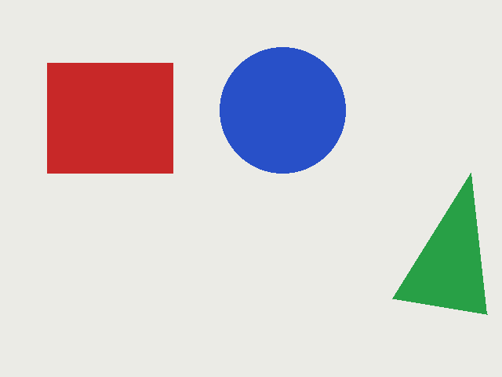

# th_basic_cv

A starting point for perception nodes: a basic OpenCV pipeline that runs on
bundled sample images or on any live camera topic.

For each frame it converts to grayscale, blurs, finds Canny edges, and boxes
every outer contour larger than a minimum area. It publishes the edge map and
an annotated copy of the image, and logs the object count, mean brightness and
processing time once a second.



## Nodes

### `sample_image_publisher`

Publishes every `.png`/`.jpg` in a folder on `image_raw`, one per tick, on a loop.

| Parameter | Default | Meaning |
| --- | --- | --- |
| `image_dir` | this package's `sample_images/` | Folder to read |
| `rate_hz` | `1.0` | Images per second |
| `frame_id` | `camera` | `header.frame_id` on each image |

### `basic_cv_node`

| Topic | Direction | Type |
| --- | --- | --- |
| `image_raw` | in | `sensor_msgs/Image` (`bgr8`, `rgb8` or `mono8`) |
| `image_edges` | out | `sensor_msgs/Image` (`mono8`) |
| `image_annotated` | out | `sensor_msgs/Image` (`bgr8`) |

| Parameter | Default | Meaning |
| --- | --- | --- |
| `blur_kernel` | `5` | Gaussian blur size in pixels (even values are rounded up) |
| `canny_low` | `50.0` | Canny lower threshold |
| `canny_high` | `150.0` | Canny upper threshold |
| `min_contour_area` | `200.0` | Ignore contours smaller than this, in pixels |

Parameters are read on every frame, so you can tune them while it runs:

```bash
ros2 param set /basic_cv_node canny_low 10.0
ros2 param set /basic_cv_node canny_high 30.0
```

## Build and run

Inside the dev container (see the repo README):

```bash
colcon build --packages-select th_basic_cv
source install/setup.bash
ros2 launch th_basic_cv basic_cv_demo.launch.py
```

Expected log: `3 objects` for `01_shapes.png`, `5 objects` for `02_blocks.jpg`,
and `0 objects` for `03_low_light.png` until you lower the Canny thresholds
(with the values above it finds both shapes).

To run on a camera instead, start any node that publishes images and point the
CV node at its topic:

```bash
# vision_test's webcam node publishes on image_raw
ros2 run vision_test ascii_camera_node
ros2 launch th_basic_cv basic_cv_demo.launch.py use_samples:=false

# or a camera on another topic
ros2 launch th_basic_cv basic_cv_demo.launch.py use_samples:=false image_topic:=/image
```

To see the output, open `image_annotated` or `image_edges` in Foxglove or
`rqt_image_view`.

## Tests

```bash
colcon test --packages-select th_basic_cv
colcon test-result --verbose
```

The gtest suite checks the pipeline on synthetic images and on the sample
images (3 and 5 objects), plus the image conversions.

## Code layout

- `src/basic_cv.cpp`: the pipeline itself, plain OpenCV with no ROS, so it
  is easy to test and reuse.
- `src/image_conversions.cpp`: `sensor_msgs/Image` to and from `cv::Mat`
  without `cv_bridge`, which the base Docker image doesn't include.
- `src/basic_cv_node.cpp`, `src/sample_image_publisher.cpp`: thin ROS wrappers.
- `scripts/make_sample_images.py`: regenerates `sample_images/`.
